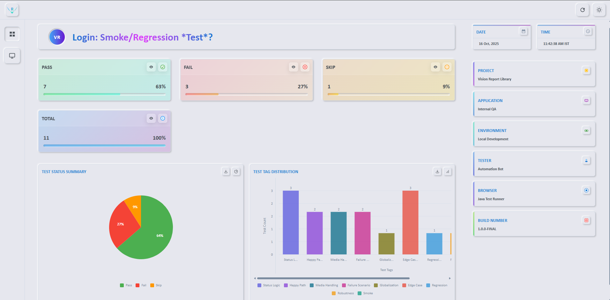
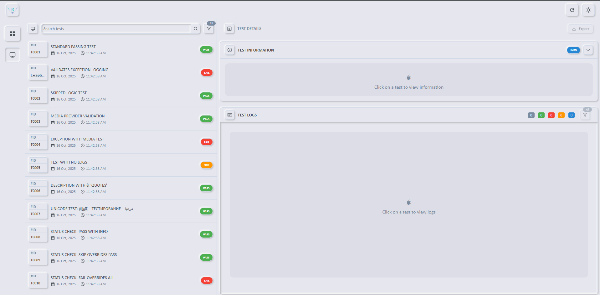
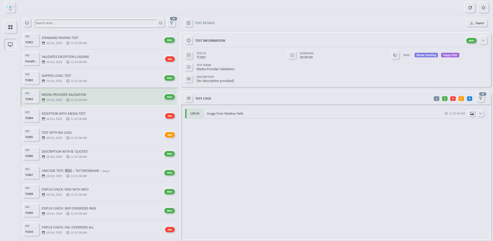
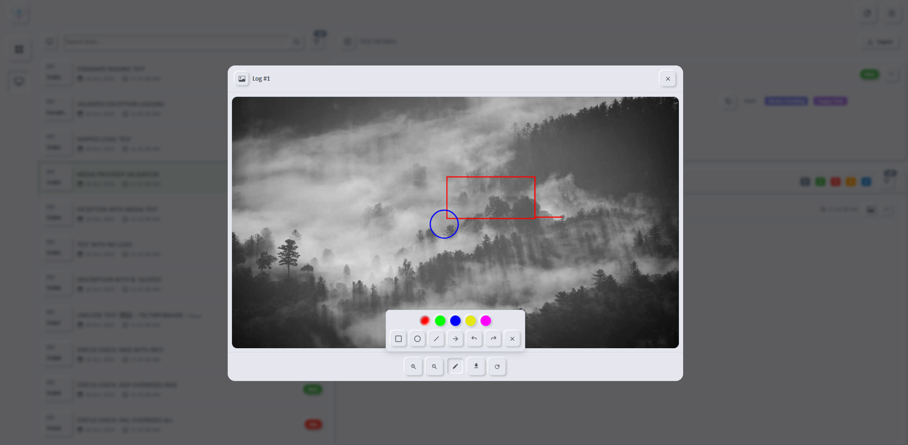

<p align="center">
  <strong>Vision Report for Java</strong>
</p>

<p align="center">
  <svg width="150" height="150" viewBox="40 50 160 120" style="display:block;margin:auto" aria-label="Vision Report Logo">
    <defs>
      <linearGradient id="auroraGradient" x1="60" y1="70" x2="180" y2="150" gradientUnits="userSpaceOnUse">
        <stop offset="0%" stop-color="#6D5BFF">
          <animate attributeName="stop-color" values="#6D5BFF;#00E0FF;#00FFA3;#6D5BFF" dur="3s" repeatCount="indefinite" />
        </stop>
        <stop offset="50%" stop-color="#00E0FF">
          <animate attributeName="stop-color" values="#00E0FF;#00FFA3;#FF6DCB;#00E0FF" dur="3s" repeatCount="indefinite" />
        </stop>
        <stop offset="100%" stop-color="#00FFA3">
          <animate attributeName="stop-color" values="#00FFA3;#FF6DCB;#6D5BFF;#00FFA3" dur="3s" repeatCount="indefinite" />
        </stop>
      </linearGradient>
      <filter id="wingShadow" x="-20%" y="-20%" width="140%" height="140%">
        <feDropShadow dx="0" dy="4" stdDeviation="4" flood-color="#6D5BFF" flood-opacity="0.25" />
      </filter>
      <linearGradient id="vrTextGradient" x1="0" y1="0" x2="1" y2="1">
        <stop offset="0%" stop-color="#6D5BFF" />
        <stop offset="100%" stop-color="#00FFA3" />
      </linearGradient>
    </defs>
    <path d="M50 65 Q120 210 190 65 Q165 105 120 160 Q75 105 50 65 Z" fill="url(#auroraGradient)" filter="url(#wingShadow)" opacity="0.95" />
    <text x="120" y="120" text-anchor="middle" font-family="Montserrat, Arial, sans-serif" font-size="60" font-weight="900" fill="url(#vrTextGradient)" opacity="1" style="letter-spacing:-2px">R</text>
  </svg>
</p>

<p align="center">
  <strong>The simplest way to create beautiful, interactive, and standalone HTML test automation reports.</strong>
</p>

<p align="center">
  <a href="https://mr-dk007.github.io/vision-report-java/demo/"></a>
</p>

<p align="center">
  <a href="https://opensource.org/licenses/Apache-2.0"></a>
  <a href="https://central.sonatype.com/artifact/io.github.mr-dk007/vision-report-core"></a>
  
  <a href="https://github.com/mr-dk007/vision-report-java/actions"></a>
  
  <a href="https://github.com/mr-dk007/vision-report-java/stargazers"></a>
</p>

---

## Table of Contents

- [Overview](#overview)
  - [Live Report Showcase](#live-report-showcase)
  - [Why Vision Report?](#why-vision-report)
- [Features](#features)
- [Quick Start](#quick-start)
  - [1. Add Maven Dependency](#1-add-maven-dependency)
  - [2. Initialize Vision Report](#2-initialize-vision-report)
- [3. Example Test Flow](#3-example-test-flow)
  - [3.1 Create a Test Case](#3-1-create-a-test-case)
  - [3.2 Log Exceptions](#3-2-log-exceptions)
  - [3.3 Attach Media](#3-3-attach-media)
  - [3.4 Generate Final HTML Report](#3-4-generate-final-html-report)
- [3.5 Complete Example](#3-5-complete-example)
- [4. Supported Media Types](#4-supported-media-types)
- [5. Edge Case Handling](#5-edge-case-handling)
- [6. Sample Report Layout](#6-sample-report-layout)
- [7. Status Hierarchy](#7-status-hierarchy)
- [API Overview](#api-overview)
  - [Test Creation](#test-creation)
  - [Logging Steps](#logging-steps)
  - [Media Attachment](#media-attachment)
    - [From Local Path](#from-local-path)
    - [From URL](#from-url)
    - [From Base64](#from-base64)
- [Null or Empty Handling](#null-or-empty-handling)
- [License](#license)
- [Contributing](#contributing)
- [Contact & Support](#support)
- [Show Your Support](#show-your-support)

---

## Overview

Vision Report is a **modern**, **lightweight**, and **dependency-free** reporting library for Java test automation projects. It generates a sophisticated single-page HTML report that is fully self-contained, interactive, and shareable.

### Live Report Showcase

> **[Click here to view the interactive demo report](https://mr-dk007.github.io/vision-report-java/demo/demo-report.html)** - See Vision Report in action with real test data!

<table>
  <tr>
    <td width="50%">
      
      <p align="center"><strong>Dashboard View</strong><br><sub>Complete overview with charts and statistics</sub></p>
    </td>
    <td width="50%">
      
      <p align="center"><strong>Test Table View</strong><br><sub>Searchable and filterable test results</sub></p>
    </td>
  </tr>
  <tr>
    <td width="50%">
      
      <p align="center"><strong>Test Details View</strong><br><sub>Step-by-step execution logs with timestamps</sub></p>
    </td>
    <td width="50%">
      
      <p align="center"><strong>Media Attachments</strong><br><sub>Screenshots and visual evidence inline</sub></p>
    </td>
  </tr>
</table>

### Why Vision Report?

- **Zero Dependencies** — No external libraries required
- **Beautiful UI** — Modern, responsive design with dark mode
- **Single File Output** — Easy to share and archive
- **Production Ready** — Battle-tested in enterprise environments
- **Secure** — Automatic XSS protection and input sanitization

---

## Features

- **Fluent, User-Friendly API** — Simple and intuitive, designed for Java automation engineers
- **Standalone HTML Report** — Single `.html` file containing all CSS, JS, and images
- **Interactive Dashboard** — Overview of test results with animated charts and statistics
- **Detailed Test View** — Search, filter, and drill down into individual tests and step-by-step logs
- **Rich Media Support** — Attach screenshots from local paths, URLs, or Base64 strings
- **Robust & Fail-Safe** — Gracefully handles errors without breaking your suite
- **Light & Dark Mode** — Built-in theme support for user preference
- **Edge Case Coverage** — Handles null/empty inputs, special characters, Unicode, and missing media

---

## Quick Start

### 1. Add Maven Dependency

```xml
<dependency>
    <groupId>io.github.mr-dk007</groupId>
    <artifactId>vision-report-core</artifactId>
    <version>1.0.0</version>
</dependency>
```

### 2. Initialize Vision Report

```java
import com.visionreport.api.VisionReport;

VisionReport report = new VisionReport();
report.config()
      .setTitle("Login and Checkout Suite")
      .setProjectName("Vision Report Library")
      .setApplicationName("E-Commerce QA")
      .setEnvironment("Staging")
      .setTesterName("Automation Bot")
      .setBrowser("Chrome 116")
      .addCustomInfo("Build Number", "1.2.0-RELEASE");
```

---

## 3. Example Test Flow

### 3.1 Create a Test Case

Create tests with fluent API chaining for clean, readable code:

```java
import com.visionreport.api.Status;

report.createTest("Login Test")
      .description("Validates user login flow")
      .assignCategory("Smoke", "Authentication")
      .log(Status.INFO, "Open login page")
      .log(Status.PASS, "Enter credentials")
      .log(Status.PASS, "Click login button");
```

---

### 3.2 Log Exceptions

Automatically log exceptions with full stack traces:

```java
try {
    int result = 10 / 0;
} catch (Exception e) {
    report.createTest("Division by Zero Test")
          .assignCategory("Edge Case")
          .logException(e);
}
```

> **Tip:** `logException()` automatically marks the test as `FAIL` and includes the full stack trace in the report.

---

### 3.3 Attach Media

Enrich your test reports with screenshots from multiple sources:

```java
report.createTest("Checkout Screenshot Test")
      .assignCategory("Media Handling")
      .log(Status.PASS, "Step 1: Checkout Page Loaded", "Screenshot attached",
           MediaProvider.fromPath("checkout.png"))
      .log(Status.PASS, "Step 2: Confirmation Page", "Loaded via URL",
           MediaProvider.fromUrl("https://example.com/screenshot.png"))
      .log(Status.PASS, "Step 3: Base64 Screenshot", "Embedded Base64",
           MediaProvider.fromBase64(base64String));
```

---

### 3.4 Generate Final HTML Report

Once all tests are complete, generate the final HTML report:

```java
report.flush();
```

**Output File:**

The report will be generated with the following naming convention:

```plaintext
VR-{ReportTitle} - {SuiteName} - dd MMM yyyy - hh-mm-ss a.html
```

**Example filename:**
```plaintext
VR-Login and Checkout Suite - Vision Report Library - 16 Oct 2025 - 12-30-45 PM.html
```

---

## 3.5 Complete Example

Here's a complete end-to-end example showing all major features:

```java
import com.visionreport.api.VisionReport;
import com.visionreport.api.Status;
import com.visionreport.media.MediaProvider;

public class SampleTest {
    public static void main(String[] args) {
        // Initialize Report
        VisionReport report = new VisionReport();
        report.config()
              .setTitle("E-Commerce Test Suite")
              .setProjectName("Vision Report Demo")
              .setEnvironment("Production")
              .setTesterName("QA Team");
        
        // Test 1: Login Flow
        report.createTest("User Login Test")
              .description("Validates user authentication")
              .assignCategory("Smoke", "Authentication")
              .log(Status.INFO, "Navigate to login page")
              .log(Status.PASS, "Enter valid credentials")
              .log(Status.PASS, "Login successful");
        
        // Test 2: With Screenshot
        report.createTest("Checkout Process")
              .assignCategory("E2E", "Payment")
              .log(Status.PASS, "Add items to cart", "3 items added",
                   MediaProvider.fromPath("screenshots/cart.png"))
              .log(Status.PASS, "Proceed to checkout")
              .log(Status.PASS, "Payment successful");
        
        // Test 3: Exception Handling
        try {
            throw new RuntimeException("Payment gateway timeout");
        } catch (Exception e) {
            report.createTest("Payment Gateway Test")
                  .assignCategory("Integration")
                  .logException(e);
        }
        
        // Generate Report
        report.flush();
        System.out.println("Report generated successfully!");
    }
}
```

---

## 4. Supported Media Types

Vision Report supports multiple media attachment formats:

<table border="1" cellpadding="10" cellspacing="0" width="100%">
  <tr>
    <th align="center" width="33%">Local Path</th>
    <th align="center" width="33%">URL</th>
    <th align="center" width="34%">Base64</th>
  </tr>
  <tr>
    <td align="center">
      <code>checkout.png</code><br>
      <sub>Attach from file system</sub>
    </td>
    <td align="center">
      <code>https://example.com/screenshot.png</code><br>
      <sub>Attach from web URL</sub>
    </td>
    <td align="center">
      <code>iVBORw0KGgoAAAANSUhEUgAA...</code><br>
      <sub>Attach from Base64 string</sub>
    </td>
  </tr>
  <tr>
    <td colspan="3">
      <details>
        <summary><strong>Code Examples</strong></summary>
        <br>
        <strong>Local Path:</strong>
        <pre><code>MediaProvider.fromPath("checkout.png")</code></pre>
        <strong>URL:</strong>
        <pre><code>MediaProvider.fromUrl("https://example.com/screenshot.png")</code></pre>
        <strong>Base64:</strong>
        <pre><code>MediaProvider.fromBase64(base64String)</code></pre>
      </details>
    </td>
  </tr>
</table>

---

## 5. Edge Case Handling

Vision Report automatically handles the following edge cases gracefully:

- **Null or empty test names** → Defaults to `"Untitled Test"`
- **Null or empty log names/details** → Defaults to `"[No log name provided]"`
- **Null exceptions** → Defaults to `"Exception Occurred"`
- **Invalid media paths** → Safely ignored without breaking the report
- **Special characters & HTML** → Automatically escaped for security
- **Unicode text** → Fully supported in logs, test names, and descriptions

**Example Code:**

```java
report.createTest(null)
      .description(null)
      .log(Status.PASS, "", null);
```

> **Note:** All null and empty inputs are handled gracefully without throwing exceptions.

---

## 6. Sample Report Layout

The generated HTML report contains the following interactive sections:

<table border="1" cellpadding="15" cellspacing="0" width="100%">
  <tr>
    <td width="50%" valign="top">
      <h3>Dashboard</h3>
      <strong>Test Summary & Analytics</strong>
      <ul>
        <li>Pass/Fail/Skip/Total counts</li>
        <li>Interactive pie & bar charts</li>
        <li>Execution duration</li>
        <li>Environment details</li>
        <li>Test execution timeline</li>
      </ul>
    </td>
    <td width="50%" valign="top">
      <h3>Test Table</h3>
      <strong>Searchable & Filterable</strong>
      <ul>
        <li>Real-time search</li>
        <li>Filter by status/category</li>
        <li>Duration tracking</li>
        <li>Sortable columns</li>
        <li>Export options</li>
      </ul>
    </td>
  </tr>
  <tr>
    <td width="50%" valign="top">
      <h3>Test Details</h3>
      <strong>Step-by-step Execution</strong>
      <ul>
        <li>Timestamp for each step</li>
        <li>Status badges (PASS/FAIL/SKIP/INFO)</li>
        <li>Detailed log messages</li>
        <li>Exception stack traces</li>
        <li>Test hierarchy</li>
      </ul>
    </td>
    <td width="50%" valign="top">
      <h3>Media Viewer</h3>
      <strong>Screenshots & Attachments</strong>
      <ul>
        <li>Inline image preview</li>
        <li>Lightbox full-screen view</li>
        <li>Multiple attachment support</li>
        <li>Download capability</li>
        <li>Responsive layout</li>
      </ul>
    </td>
  </tr>
  <tr>
    <td colspan="2" align="center" bgcolor="#f6f8fa">
      <br>
      <strong>Navigation:</strong> Sidebar with Dashboard & Test tabs • <strong>Theme:</strong> Light/Dark mode toggle • <strong>Design:</strong> Responsive
      <br><br>
    </td>
  </tr>
</table>

---

## 7. Status Hierarchy

<table border="1" cellpadding="10" cellspacing="0" width="100%">
  <tr>
    <th align="center" width="10%">Priority</th>
    <th align="center" width="20%">Status</th>
    <th align="left" width="70%">Behavior</th>
  </tr>
  <tr>
    <td align="center"><strong>1</strong><br><sub>(Highest)</sub></td>
    <td align="center">
      <strong>FAIL</strong>
    </td>
    <td>
      <strong>Overrides all other statuses</strong><br>
      <sub>If any step fails, the entire test is marked as FAIL</sub>
    </td>
  </tr>
  <tr>
    <td align="center"><strong>2</strong></td>
    <td align="center">
      <strong>SKIP</strong>
    </td>
    <td>
      <strong>Overrides PASS and INFO</strong><br>
      <sub>If any step is skipped (and no failures), test is SKIP</sub>
    </td>
  </tr>
  <tr>
    <td align="center"><strong>3</strong></td>
    <td align="center">
      <strong>PASS</strong>
    </td>
    <td>
      <strong>Applied if no FAIL or SKIP exists</strong><br>
      <sub>All steps must pass for test to be marked as PASS</sub>
    </td>
  </tr>
  <tr>
    <td align="center"><strong>4</strong><br><sub>(Lowest)</sub></td>
    <td align="center">
      <strong>INFO</strong>
    </td>
    <td>
      <strong>Does not affect PASS/FAIL determination</strong><br>
      <sub>Used for informational logs only</sub>
    </td>
  </tr>
  <tr>
    <td colspan="3" bgcolor="#f6f8fa">
      <br>
      <strong>Examples:</strong><br>
      • <code>INFO</code> + <code>PASS</code> + <code>FAIL</code> → Final: <strong>FAIL</strong><br>
      • <code>INFO</code> + <code>PASS</code> + <code>SKIP</code> → Final: <strong>SKIP</strong><br>
      • <code>INFO</code> + <code>PASS</code> → Final: <strong>PASS</strong>
      <br><br>
    </td>
  </tr>
</table>

---

## API Overview

### Test Creation

Create a new test with optional description and categories:

```java
Test test = report.createTest("My Test Name");
test.description("Optional description");
test.assignCategory("Category1", "Category2");
```

---

### Logging Steps

Log different status types for test steps:

```java
test.log(Status.PASS, "Step Name", "Step Details");
test.log(Status.INFO, "Info Step");
test.log(Status.SKIP, "Skipped Step");
test.logException(new RuntimeException("Failure example"));
```

---

### Media Attachment

Attach screenshots and media in multiple formats:

#### From Local Path

```java
test.log(Status.PASS, "Screenshot step", "Attached media",
         MediaProvider.fromPath("screenshot.png"));
```

#### From URL

```java
test.log(Status.PASS, "Screenshot step", "Attached media",
         MediaProvider.fromUrl("https://example.com/screenshot.png"));
```

#### From Base64

```java
test.log(Status.PASS, "Screenshot step", "Attached media",
         MediaProvider.fromBase64(base64String));
```

---

## Null or Empty Handling

Vision Report provides robust null-safety with intelligent defaults:

<table border="1" cellpadding="10" cellspacing="0" width="100%">
  <tr>
    <th align="left" width="25%">Input Type</th>
    <th align="center" width="25%">Null/Empty Input</th>
    <th align="left" width="50%">Default Value</th>
  </tr>
  <tr>
    <td><strong>Test Name</strong></td>
    <td align="center"><code>null</code> or empty</td>
    <td><code>"Untitled Test"</code></td>
  </tr>
  <tr>
    <td><strong>Log Name</strong></td>
    <td align="center"><code>null</code> or empty</td>
    <td><code>"[No log name provided]"</code></td>
  </tr>
  <tr>
    <td><strong>Log Details</strong></td>
    <td align="center"><code>null</code> or empty</td>
    <td><code>"[No details provided]"</code></td>
  </tr>
  <tr>
    <td><strong>Exception Message</strong></td>
    <td align="center"><code>null</code></td>
    <td><code>"Exception Occurred"</code></td>
  </tr>
  <tr>
    <td colspan="3" bgcolor="#f6f8fa">
      <br>
      <details>
        <summary><strong>Example of Null-Safe Usage</strong></summary>
        <br>
        <pre><code>// All of these will work without throwing exceptions
        <p><code>report.createTest(null);
report.createTest("").description(null);
report.createTest("Test").log(Status.PASS, null, null);</code></p></code></pre>
        <br>
        <strong>Result:</strong> No exceptions thrown, graceful defaults applied
        <br><br>
      </details>
    </td>
  </tr>
</table>

---

## License

This project is licensed under the **Apache License 2.0**. See the [LICENSE](LICENSE) file for details.

---

## Contributing

We welcome contributions from the community! Here's how you can help:

### Ways to Contribute

- **Report Bugs** — Found an issue? [Open a bug report](https://github.com/mr-dk007/vision-report-java/issues/new?labels=bug)
- **Request Features** — Have an idea? [Submit a feature request](https://github.com/mr-dk007/vision-report-java/issues/new?labels=enhancement)
- **Improve Documentation** — Help us make the docs better
- **Submit Pull Requests** — Code contributions are always welcome

### Guidelines

1. Fork the repository
2. Create a feature branch (`git checkout -b feature/amazing-feature`)
3. Commit your changes (`git commit -m 'Add amazing feature'`)
4. Push to the branch (`git push origin feature/amazing-feature`)
5. Open a Pull Request

---

## Support

Need help? We're here for you!

### Get in Touch

- **Email:** deepaksahu20512001@gmail.com
- **GitHub Issues:** [Report Issues](https://github.com/mr-dk007/vision-report-java/issues)
- **Discussions:** [GitHub Discussions](https://github.com/mr-dk007/vision-report-java/discussions)

### Resources

- **Documentation:** [Full API Documentation](https://mr-dk007.github.io/vision-report-java/docs/)
- **Live Demo:** [Interactive Sample Report](https://mr-dk007.github.io/vision-report-java/demo/demo-report.html)
- **Source Code:** [GitHub Repository](https://github.com/mr-dk007/vision-report-java)

---

## Show Your Support

If you find Vision Report helpful, please consider giving it a star on GitHub! It helps us grow and improve the project.

<p align="center">
  <a href="https://github.com/mr-dk007/vision-report-java">
    
  </a>
</p>

---

<p align="center">
  <strong>Made with love by Deepak Sahu</strong>
</p>

<p align="center">
  <sub>© 2025 Vision Report. All rights reserved.</sub>
</p>
